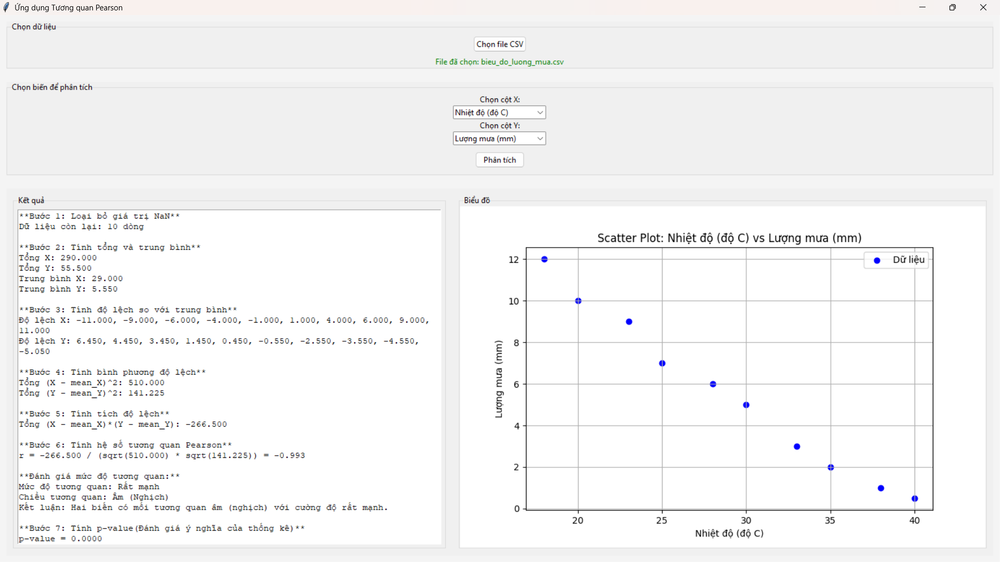

# Ứng dụng Phân tích Tương quan Pearson



## Giới thiệu

Ứng dụng Phân tích Tương quan Pearson là một công cụ trực quan được phát triển để giúp người dùng dễ dàng phân tích mối tương quan giữa hai biến số từ dữ liệu CSV. Ứng dụng hiển thị các kết quả phân tích chi tiết theo từng bước và trình bày mối tương quan dưới dạng biểu đồ trực quan.

## Tính năng

- Nhập dữ liệu từ file CSV
- Chọn biến để phân tích tương quan
- Tính hệ số tương quan Pearson và hiển thị quá trình tính toán chi tiết
- Đánh giá mức độ và chiều hướng tương quan
- Tính p-value để đánh giá ý nghĩa thống kê
- Tính khoảng tin cậy 95% cho hệ số tương quan
- Hiển thị biểu đồ phân tán (Scatter Plot) để minh họa mối tương quan

## Yêu cầu hệ thống

- Python 3.6 trở lên
- Các thư viện:
  - tkinter
  - pandas
  - numpy
  - scipy
  - matplotlib

## Cài đặt

1. Đảm bảo máy tính đã cài đặt Python 3.6 trở lên
2. Cài đặt các thư viện cần thiết:

```bash
pip install pandas numpy scipy matplotlib
```

3. Tải mã nguồn và chạy ứng dụng:

```bash
python pearson.py
```

## Cách sử dụng

1. Khởi động ứng dụng
2. Nhấn nút "Chọn file CSV" để tải dữ liệu
3. Chọn hai biến cần phân tích tương quan từ menu thả xuống
4. Nhấn nút "Phân tích" để bắt đầu quá trình phân tích
5. Xem kết quả phân tích chi tiết ở phần bên trái và biểu đồ phân tán ở phần bên phải

## Giải thích kết quả

Ứng dụng hiển thị kết quả theo 8 bước:

1. Loại bỏ giá trị NaN
2. Tính tổng và trung bình của hai biến
3. Tính độ lệch so với trung bình
4. Tính bình phương độ lệch
5. Tính tích độ lệch
6. Tính hệ số tương quan Pearson và đánh giá mức độ tương quan
7. Tính p-value để đánh giá ý nghĩa thống kê
8. Tính khoảng tin cậy 95%

## Về dự án

Dự án này được phát triển bởi Trần Công Minh, sinh viên khoa Công nghệ thông tin, trường Đại học Công Thương TP.HCM (HUIT).

## Dữ liệu mẫu

Dự án bao gồm một số tập dữ liệu mẫu để thử nghiệm:

- father_son_height.csv: Dữ liệu về chiều cao của bố và con trai
- xemtv_diemthi.csv: Dữ liệu về thời gian xem TV và điểm thi
- danh_sach_diem.csv: Dữ liệu về điểm số
- bieu_do_luong_mua.csv: Dữ liệu về lượng mưa

## Giấy phép

Dự án này được phát hành theo giấy phép MIT.

---

© 2025 Trần Công Minh - Đại học Công Thương TP.HCM (HUIT)
